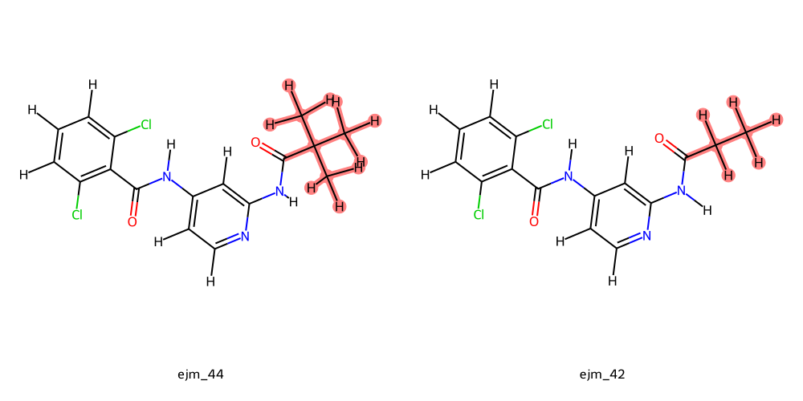

# Command Line Interface

In this tutorial, we will use the command line interface of EasyBFE to setup RBFE simulations. We will use TYK2 system as an example.

## Step 1: Create a project folder

Easybfe uses "project" to manage a relative binding free energy task. A "project" is located in a specified directory and contains all files involved in a RBFE calculation, including ligands, proteins, simulation files for each perturbation.

To create a RBFE project, use:
```bash
easybfe -d /path/to/project init
```
Replace the `/path/to/project` with the actual path that you want your project to be located.

Then, the project directory will be created. Change your directory to this project directory (the following commands need to be executed in the project directory):
```bash
cd /path/to/project
```

and there will be the following sub-directories:

```bash
-- /path/to/project/
   |-- ligands/
   |-- proteins/
   |-- perturbations/
   |-- uploads/
```
Description of each sub-folder:
+ `ligands`: contains all ligand files, including structure file (.sdf), force field topology file (prmtop)
+ `proteins`: contains all protein structure files (.pdb)
+ `perturbations`: contains all alchemical RBFE simulation files
+ `uploads`: used in Web GUI, CLI users can ignore it

## Step 2: Add a protein

Use this command to add a protein PDB file.

```bash
easybfe add_protein -i examples/tyk2/tyk2_pdbfixer.pdb -n tyk2
```
Here, users needs to add a **"prepared"** protein PDB file, which means that being hetero atoms deleted, missing atoms/residues added, terminal properly treated, and hydrogens added. It is recommended to use [PDBFixer](https://github.com/openmm/pdbfixer) to prepare a protein file. EasyBFE will check if the added protein PDB file is able to be parametrized with Amber14SB force field with OpenMM, and if you want to disable this check, use `--no-check-ff` flag.

Then you will see in the proteins directory that a protein with name specified in `-n` option has been added:

```
-- /path/to/project/
   |-- ligands/
       |-- tyk2/
           |-- tyk2.pdb
```

## Step 3: Add ligands

Use this following command to add ligands and parametrize them:
```bash
easybfe add_ligand -p tyk2 -i examples/tyk2/ejm_44.sdf -f gaff2 -c bcc
```
Breakdown of the options or use `easybfe add_ligand -h` for more information.:
+ `-p`: specify the name of the protein structure that the ligands belongs to.
+ `-i`: the input ligand structures (.sdf)
+ `-f`: the forcefield to parametrize the ligand. Supported values: `gaff`, `gaff2`, openff series supported by `openff-toolkit` (e.g. `openff-2.1.0`)
+ `-c`: method to assign atomic partial charges. Supported values: `bcc` (AM1-BCC), `gas` (Gasteiger)

Then you will see the ligand has been added:

```
-- /path/to/project/
   |-- proteins/
       |-- tyk2/
           |-- ejm_44/
               |-- ejm_44.sdf     # sdf file (molecule structure)
               |-- ejm_44.png     # 2D visulization
               |-- ejm_44.prmtop  # Amber-formatted topology file with force field parameters
               |-- ejm_44.inpcrd  # Amber-formatted coordinate file
               |-- ejm_44.top     # Gromacs-formatted topology file with force field parameters
               |-- info.json      # basic information of this molecule
```

*New features to add: Wrap PDBFixer in easybfe and offer API*

**Note**

1. The `-i` option supports the following types of input:

   + One sdf file contains one ligand. In this case, by default, the name of this ligand will be the basename of the file. For example, `ejm_44` for `examples/tyk2/ejm_44.sdf`. Users can also specify its name with `-n` option in this case:

   ```bash
   easybfe add_ligand -p tyk2 -i examples/tyk2/ejm_44.sdf -f gaff2 -c bcc -n ejm_44_custom_name
   ```

   + One sdf file contains multiple ligands. In this case, the name of each ligand specified in the sdf file (the first line of each mol block) will be used as the name in the project.

   ```bash
   easybfe add_ligand -p tyk2 -i examples/tyk2/tyk2_ligands.sdf -f gaff2 -c bcc -m 10
   ```

   The `-m` option specifies how many CPU cores to run the jobs in parallel.

   + Multiple sdf files with pattern matching but each file must contain one ligand. If not, only the first ligand will be added. In this case, the basename of each sdf file will be used as the ligand's name. For example,

   ```bash
   easybfe add_ligand -p tyk2 -i *.sdf -f gaff2 -c bcc -m 10
   ```

2. If there has already been a ligand with the same name, easybfe will raise an error. Users can toogle `--overwrite` option to overwrite the existing ligand.

3. When `-i` option takes only one sdf file with one ligand, users can also pass in a customized forcefield (topology) for this ligand through `-f` option. This customized forcefield file has to be in Amber .prmtop format or Gromacs .top format. However, the customized force field should not contain terms other than harmonic bond/angles, peroidic torsions, Lennard-Jones, charge-charge interactions. Torsion-torsion coupling (CMAP) term, virtual sites are not supported.

```bash
easybfe add_ligand -p tyk2 -i examples/tyk2/ejm_44.sdf -f examples/tyk2/ejm_44.prmtop
```
4. You can add experimental values with property name `dG.expt` (in kcal/mol) or `affinity.expt` (in uM) in the sdf file and `easybfe report` will use report them together with the FEP values. 
5. Gasteiger charges is ONLY suitable for debugging. It is strongly not recommended in pratical use. 

## Step 4: Add perturbations
First, let's add another ligand (`ejm_42`) if you add only `ejm_44` in the project.

```bash
easybfe add_ligand -p tyk2 -i examples/tyk2/ejm_42.sdf -f gaff2 -c bcc
```

Then, use the following command to add a perturbation between `ejm_44` and `ejm_42`:

```bash
easybfe add_perturbation -p tyk2 --ligandA ejm_44 --ligandB ejm_42 -n "ejm_44~ejm_42" --config examples/config_5ns.json
```

Breakdown of the options:
+ `-p`: specify the name of the protein structure that the ligands belongs to.
+ `--ligandA`, `--ligandB`: name of the two ligands that form this relative pair.
+ `-n`: name of this perturbation. If not specified, the default name of `{ligandA}~{ligandB}` will be used. 
+ `--config`: Path to the configuration file.

This command will prepare all simulation files (including atom mapping, building dual topology, setting up simulation box, adding solvents/ions) and write a submission file:

```
-- /path/to/project/
   |-- rbfe/
       |-- tyk2/
           |-- ejm_44~ejm_42/
               |-- atom_mapping.png  # Atom mapping
               |-- solvent/
                   |-- ...
                   |-- run.slurm     # slurm submission file for solvent-phase simulation
               |-- complex/
                   |-- ...
                   |-- run.slurm     # slurm submission file for complex-phase simulation
               |-- ...
```

One should submit the two SLURM files under the `solvent/` and `complex/` manually after checking that the atom mapping is good. EasyBFE will also generate inputs for gas phase simulation under the `gas/` folder, but that is only useful when one try to analyze the (de)solvation contribution in the total $\Delta\Delta G$. For simple $\Delta\Delta G$ calculation, one can safely ignore them.

An example of good atom mapping between ejm_44~ejm_42:




**Note**:

1. The RBFE result for perturbation `ligandA~ligandB` is $\Delta G_{ligandB}-\Delta G_{ligandA}$
2. If you are confident with the atom mapping, you can toogle `--submit` in the command and the files will be submitted automatically. 
3. If there has already been a perturbation with the same name, easybfe will raise an error. Users can toogle `--overwrite` option to overwrite the existing perturbation.
4. Users can also prepare multiple perturbations with one command:

   ```bash
   easybfe add_perturbation -p tyk2 -l perturbations.txt --config example/config_5ns.json -m 2
   ```

   + `-l`: File contains list of perturabtions. In the file, each line contains two ligand names seperated by a whitespace. For example,

   ```
   ejm_45 ejm_42
   ejm_44 ejm_42
   ```

   + `-m`: number of processors to run in parallel 

   In this option, the perturbations will be named as `ejm_44~ejm_42`, `ejm_45~ejm_42` by default.

## Step 5: Analyze
Use the following command to analyze the simulation. This command will automatically found all perturbations that are finished yet not analyzed and then analyze them. 
```bash
easybfe analyze -m 10
```
Here `-m` specify the number of processors to run in parallel. The analysis will do the following things:

+ Use MBAR to gives free energy estimation for both solvated/complex legs, then gives the final binding free energy differences ($\Delta\Delta G$)
+ Convergence analysis
+ Phase-space overlap analysis
+ Calculate RMSD for end-states
+ Torsion distribution for end-states 

You will see the following files generated:
```
-- /path/to/project/
   |-- rbfe/
       |-- tyk2/
           |-- ejm_44~ejm_42/
               |-- result.json
               |-- total_convergence.csv
               |-- total_convergence.png
               |-- solvent/
                   |-- convergence.csv
                   |-- convergence.png
                   |-- overlap.png
                   |-- rmsd.png
                   |-- lambda0/prod/torsion_*-*-*-*.png
                   |-- lambda15/prod/torsion_*-*-*-*.png
                   |-- ...
               |-- complex/
                   |-- convergence.csv
                   |-- convergence.png
                   |-- overlap.png
                   |-- rmsd.png
                   |-- lambda0/prod/torsion_*-*-*-*.png
                   |-- lambda15/prod/torsion_*-*-*-*.png
                   |-- ...
               |-- ...
```

The `result.json` contains all the free energy results:

```
{
    "dG": {
        "solvent": -14.013058224093358,  # G(B, solvent) - G(A, solvent)
        "complex": -16.258651728930776   # G(B, complex) - G(A, complex)
    },
    "dG_std": {
        "solvent": 0.025954616452471727, # standard deviations estimated by MBAR
        "complex": 0.03499030344808139
    },
    "ddG": {
        "total": -2.2455935048374176  # The final ddG, i.e. dG(B) - dG(A)
    },
    "ddG_std": {
        "total": 0.04356562234817417  # std of ddG
    }
}
```
The experimental $\Delta\Delta G$ for this pair is -2.36 kcal/mol, which is quite close to our calcualted results -2.24 kcal/mol.

## Step 6: Report
The following command will report the result of the whole project and dump to directory `./report/`.

```bash
easybfe report -o ./report/
```

Easybfe will collect all calculated binding free energies (RBFE) and use the maximum likelihood estimation (MLE) algorithm to give the calculated absolute binding free energy (ABFE) of each ligand. The ABFEs are shifted to make the average of calculated ABFEs the same as the average experimental values.